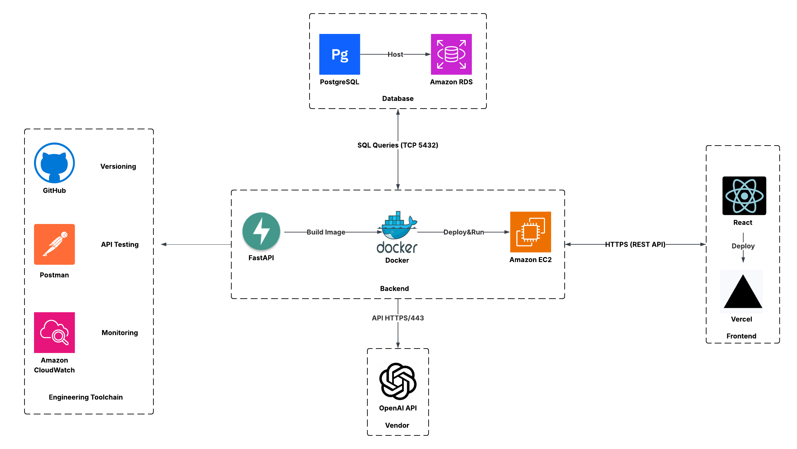

# Architecture Diagram Explanation

## Diagram

## Explanation

Our system is designed as a modular web application composed of a React frontend, a FastAPI backend containerized with Docker, a PostgreSQL database that is also containerized with Docker and hosted on an Amazon EC2 instance, and an integration with the OpenAI API. We are using tools such as GitHub for version control, Postman for API testing, and Amazon CloudWatch for monitoring.

### Frontend: React on Vercel

We chose React for its strong community, reusable components, and developer familiarity. Hosting on Vercel offers instant deployments, automatic SSL, and preview environments, which greatly helps with the development process.
**Trade-off**: Vercel emphasizes simplicity and static delivery, so if we later require server-side rendering (SSR) or advanced SEO, we may need to migrate to Next.js.

### Backend: FastAPI on Docker + AWS EC2

The FastAPI framework provides high performance and automatic OpenAPI documentation, which accelerates backend development and integration with API testing tools. Docker ensures consistent environments from local development to production. Deployment on Amazon EC2 offers full control over the runtime and networking.
**Trade-off**: EC2 requires more manual scaling and maintenance compared to managed services like AWS Lambda. However, this approach gives us flexibility at low initial cost, with a clear upgrade path to container orchestration when needed.

### ~~Database: PostgreSQL on Amazon RDS~~(initial decision)

~~We selected PostgreSQL for its maturity and support for advanced features such as JSONB, which can accommodate both structured and semi-structured data. Hosting it on Amazon RDS offloads operational burdens like backups and patching, while providing scalability and reliability.
**Trade-off**: RDS is costlier than self-hosted options, but this is justified by the reduced maintenance effort and better reliability, which are crucial for long-term sustainability.~~

### Database: Dockerized PostgreSQL on AWS EC2 (changed decision)

We run PostgreSQL inside a Docker container on an Amazon EC2 instance, mounting an EBS volume for persistent storage. This approach aligns the database environment with our container-first workflow, keeps dev/staging/prod configurations consistent, and reduces cost at the MVP stage. The backend connects over private networking on port 5432 (restricted by Security Groups). We use CloudWatch/agent for metrics and logs, and schedule automated backups (e.g., pg_dump to S3 and/or EBS snapshots) with a tested restore runbook.
**Trade-off**: Compared to RDS, this design requires us to manage backups, patching, and high availability ourselves, and it lacks managed multi-AZ failover. We accept this operational overhead for now in exchange for lower cost, tighter CI/CD integration, and faster iteration. As usage grows or HA/SLA requirements increase, we plan to migrate to a managed option (RDS/Aurora) to gain automated failover and maintenance.

### Vendor Integration: OpenAI API

The OpenAI API allows us to deliver AI-powered features without managing our own models or inference infrastructure. The backend communicates with it securely over HTTPS.
**Trade-off**: This introduces vendor dependency and potential issues with latency, rate limits, or cost. To mitigate this, we will maintain the option of switching to alternate providers or self-hosted models if required.

### Engineering Toolchain

**GitHub**: Centralized repository for version control, Issues, Projects, and Releases, supporting collaboration and milestone tracking.

**Postman**: Enables quick validation of APIs and serves as shared documentation for the team.

**Amazon CloudWatch**: Provides monitoring and alerting on system metrics, ensuring visibility into application health.

## Alignment with Use Cases

This architecture directly supports our Critical User Journeys (CUJs) by ensuring:

1. Fast iteration and user testing (React + Vercel previews, Postman collections).

2. Reliable data management (PostgreSQL on RDS for strong integrity guarantees).

3. Seamless AI integration (OpenAI API via FastAPI endpoints).
