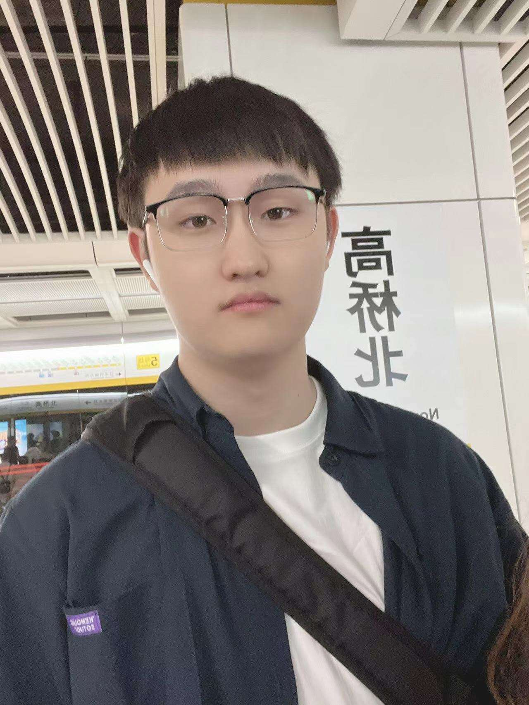

# Leon Wang

- Software Developer
- leonzihao.wang@mail.utoronto.ca | zihaow1314@gmail.com

## Links

- [GitHub](https://github.com/Zizizzz)
- [LinkedIn](https://www.linkedin.com/in/leon-wang-uoft/)

## About Leon

Leon is a fourth-year Computer Science Specialist student at the University of Toronto. He has full-stack development experience and completed a one-year internship as a backend developer at VirgoCX. During his internship, he gained proficiency in Java, Spring Boot, MyBatis, and MySQL, and is also skilled in writing scripts and handling data with Python. In his free time, Leon enjoys cooking, listening to music, and playing games.

## Strengths

- Software Development
- Time Management
- Team Collaboration, and Communication

## Weaknesses

- Sometimes overly perfectionistic, leading to frequent changes of ideas
- Decision-Making Speed (Tend to overanalyze options before deciding)
- Writing Conciseness(Sometimes provide too much detail in documentation)