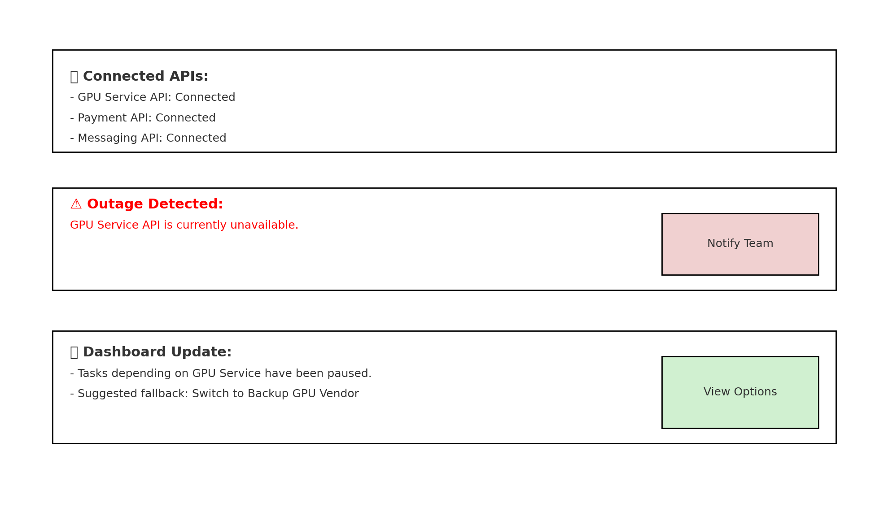

# Use Cases

## Jobs To Be Done (JTBD)

1. **As a product manager**, I want to input product requirements and deadlines, so that the system can automatically generate a realistic timeline and assign tasks to team members.  
2. **As a startup founder**, I want to automatically generate marketing posts after defining product features, so that I can quickly communicate product updates to customers and stakeholders.  
3. **As a developer**, I want to be notified when a vendor API is unavailable, so that I can adjust my plan and avoid unexpected delays.  

---

## Critical User Journeys (CUJs)

### CUJ 1: Automated Timeline & Task Assignment  
- **Scenario**: The user enters a new product requirement and deadline into the system.  
- **Journey**:  
  1. User logs into the platform.  
  2. User creates a new project entry and fills in requirements and deadlines.  
  3. The system analyzes available team members, their skills, and workload.  
  4. The system generates a project timeline and automatically assigns tasks.  
  5. The user reviews and approves the proposed plan.  
- **UI/UX demonstration**:

- **Tie back to JTBD 1**

---

### CUJ 2: Automatic Marketing Post Generation  
- **Scenario**: The user finalizes product features and wants to share them publicly.  
- **Journey**:  
  1. User selects a completed feature or milestone in the project dashboard.  
  2. The system compiles relevant details (feature description, benefits, release notes).  
  3. The AI generates a draft marketing post in multiple formats (LinkedIn, Twitter, email).  
  4. User reviews, edits, and approves the post.  
  5. Post is published or exported for the marketing team.  
- **UI/UX demonstration**:

- **Tie back to JTBD 2**

---

### CUJ 3: Vendor API Availability Monitoring  
- **Scenario**: The team depends on third-party APIs (e.g., GPU service, payment API) for development.  
- **Journey**:  
  1. User connects the platform to required vendor APIs.  
  2. The system continuously monitors the availability and status of these APIs.  
  3. When downtime or outage is detected, the user receives an instant notification.  
  4. The platform automatically adjusts project status (e.g., pausing dependent tasks).  
  5. User views fallback options or reschedules tasks in the dashboard.  
- **UI/UX demonstration**:

- **Tie back to JTBD 3**

---

### CUJ 4: Backup Plan Recommendation
- **Scenario**: A task cannot meet its deadline due to blocked dependencies.  
- **Journey**:  
  1. User receives a warning that a task is delayed or blocked.  
  2. The system analyzes available resources and alternative workflows.  
  3. AI suggests a backup plan (e.g., reassigning tasks, extending deadlines).  
  4. User reviews and accepts/rejects the proposed plan.  
- **UI/UX demonstration**:

- **Tie back to JTBD 1 2 3**

---

### CUJ 5: Weekly Summary & Reporting
- **Scenario**: The team wants an overview of progress and communication material.  
- **Journey**:  
  1. At the end of each week, the system collects completed tasks and upcoming deadlines.  
  2. The system generates a summary report for the team.  
  3. It also drafts external communication (e.g., customer newsletter, investor update).  
  4. User reviews and approves the report/post.  
- **UI/UX demonstration**:

- **Tie back to JTBD 1 2 3**

---

## Functional Requirements

1. **Project & Task Management**
   - Users can create projects, input requirements, and set deadlines.
   - The system automatically generates timelines, tasks, and assigns them to team members based on skills and availability.
   - Users can view and adjust task assignments manually if needed.

2. **AI-Powered Features**
   - Automated marketing post generation across multiple platforms (LinkedIn, Twitter, Email).
   - Prediction of timeline delays and task risks based on historical data and dependencies.
   - Backup plan recommendations when tasks are blocked or deadlines cannot be met.

3. **Integration with External Vendors**
   - Ability to connect and monitor third-party APIs (e.g., GPU services, payment APIs).
   - Real-time detection of outages and automatic status updates in the dashboard.
   - Notifications sent to the team when critical vendor services fail.

4. **Collaboration Tools**
   - Shared dashboard where team members can track tasks and project progress.
   - Weekly summary reports generated for internal alignment.
   - Drafts of customer-facing updates (newsletters, investor updates) created automatically.

5. **Deployment & Accessibility**
   - Web-based application accessible on modern browsers.
   - Authentication system for secure access.
   - Role-based permissions (e.g., admin, developer, marketer).

---

## Non-Functional Requirements

1. **Performance**
   - Task assignment and timeline generation should complete in under 15 seconds.
   - API monitoring should check status at least every hour.

2. **Reliability**
   - The system must handle downtime gracefully, with failover notifications.
   - Data consistency must be maintained even during outages.

3. **Scalability**
   - Support for growing teams (from 5 to 100+ members).
   - Ability to handle multiple concurrent projects without performance degradation.

4. **Usability**
   - Intuitive user interface with minimal learning curve.
   - Low-fidelity UX must evolve into a clean, modern design suitable for non-technical users (e.g., marketers, managers).

5. **Security**
   - Secure authentication and role-based access control.
   - Data encryption for stored project details and credentials.

6. **Maintainability**
   - Codebase should follow modular design for easy updates.
   - All major architecture and tech decisions documented in ADRs.

7. **Portability**
   - Application should be deployable on cloud platforms (AWS, GCP, Azure) with minimal changes.
   - Support containerization (Docker) for easy deployment.

---
