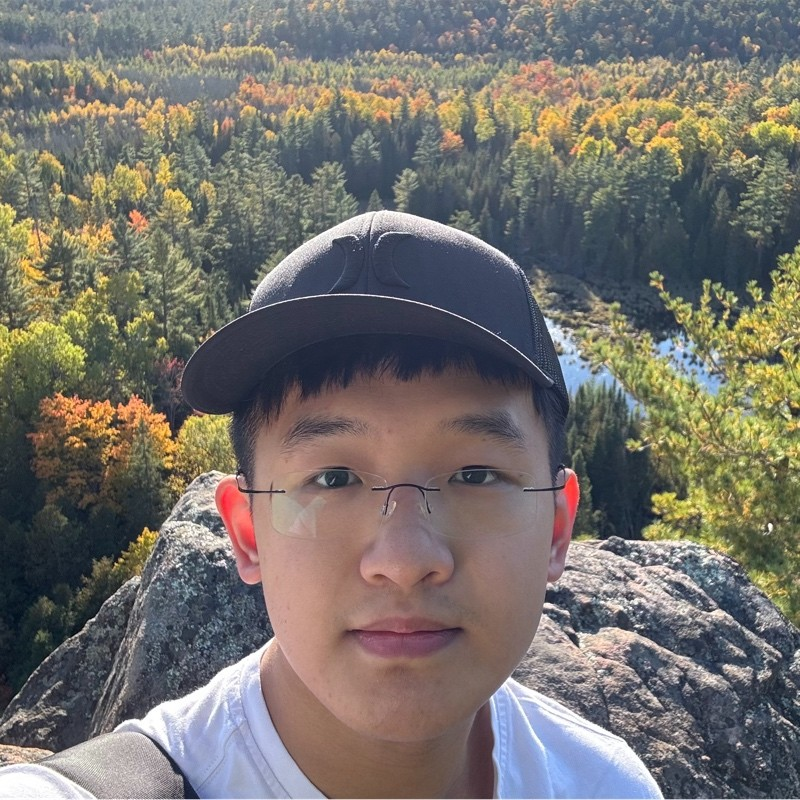

# Ben Cheng

- Software Developer / Machine Learning Engineer
- bencheng0609@gmail.com

## Links

- [GitHub](https://github.com/BenCheng2)
- [LinkedIn](https://www.linkedin.com/in/bencheng2/)
- [Website](https://bencheng2.github.io/)
- [Resume](https://bencheng2.github.io/files/CV_20250904.pdf)

## About Ben

Ben Cheng is a fourth-year Computer Science Specialist at the University of Toronto. Over the past year, he worked as a 5G Machine Learning Software Developer at Ericsson, where he applied reinforcement learning algorithms such as DQN and PPO to optimize real-time wireless scheduling. He also developed strong proficiency in time-series data analysis, CI/CD pipeline implementation, C++ embedded programming, and deep learning. With experience across multiple areas of computer science and exposure to diverse technology stacks, he is highly adaptable and passionate about learning and advancing new technologies.

## Strengths

- Strong ability to manage and prioritize multiple tasks effectively
- Proficient across a wide range of commonly used technologies, including frontend, backend, and machine learning  
- Skilled in debugging and resourceful in finding solutions to complex problems

## Weaknesses

- Sometimes lose track of earlier design decisions or ideas if not documented well
- Tend to learn best through personal trial and error, and still improving at leveraging others’ experiences directly
- Can find it challenging at times to maintain a healthy work–life balance when deeply engaged in projects