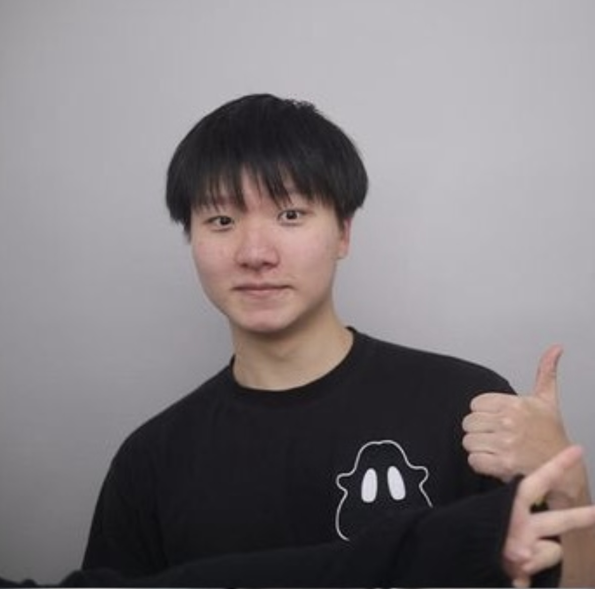

# Brenden Wang

- Full Stack Software Developer
- brenden.wang@mail.utoronto.ca

## Links

- [GitHub](https://github.com/Brenden-Yiping-Wang)
- [LinkedIn](https://www.linkedin.com/in/brenden-yiping-wang-b9232927b/)

## About Brenden

Brenden is a Full Stack Software Developer with hands-on experience in building scalable applications, integrating AI technologies, and improving developer workflows. Currently working at Chatsimple in Toronto, he has expertise in CI/CD pipeline optimization, AI agent development using RAG and LLMs, and real-time voice AI integration. He specializes in AWS cloud services and modern web technologies.

## Strengths

- AI/ML Integration & Prompt Engineering
- Full Stack Development (Frontend/Backend)
- Cloud Architecture (AWS Lambda, SQS)
- Effective Communication: Clearly explains technical ideas to team members and stakeholders.
- Team Collaboration: Works well in cross-functional teams to achieve project goals.

## Weaknesses

- Public Speaking
- Design/UI Aesthetics
- Mobile Development
